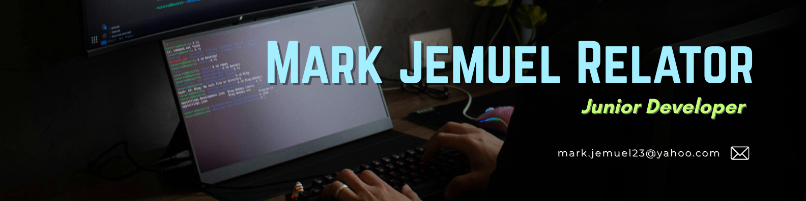

<!--Banner-->

<!--Night Owl image-->

  

<!--Header Name-->
#  I'M Mark! 
*Digital Craftsman (Developer / Programmer)*
  

<!--Start Intro-->               

I’m a Junior Full Stack Developer, open for commission-based work on capstone projects. I enjoy building practical solutions and contributing to impactful projects.

- ✨ Fresh Graduate :)
- 🌱 I’m currently learning many things, I believe that everyday is a learning opportunity.
- 💻 Visit my [Portfolio](https://beatless23.github.io/portfolio) for more details about me.
<!--End Intro-->

---

<!--Languages and Tools Section-->       
<h2 align="center">Tᴇᴄʜ sᴛᴀᴄᴋ</h2> 
<picture>
  <source media="(prefers-color-scheme: dark)" srcset="./Skills_Animation_Dark.gif">
  <source media="(prefers-color-scheme: light)" srcset="./Skills_Animation_White.gif">
  
</picture>
 

<h3 align="left">Current Learning</h3>
<ul align="left">
  <li>Deepening my knowledge in Machine Learning and AI.</li>
  <li>Exploring advanced React.js patterns and state management techniques.</li>
  <li>Improving my skills in cloud computing with AWS and Azure.</li>
</ul>
  
<h3 align="left">Latest Blog Posts</h3>
<ul align="left">
  <li><a href="https://dev.to/dev_kiran/storyblok-mcp-server-let-ai-agents-manage-your-content-3jaa">🔥Storyblok MCP Server: Let AI Agents Manage Your Content 🤖</a></li>
  <li><a href="https://dev.to/dev_kiran/pulstack-deploy-your-static-site-to-s3-or-github-in-1-min-5cin">🔥Pulstack: Deploy your static site to S3 or GitHub in <1 min🙂</a></li>
  <li><a href="https://dev.to/dev_kiran/i-tried-out-qodos-new-embed-model-qodo-embed-1-40h5">I Tried Out Qodo's New Embed Model Qodo-Embed-1🤯</a></li>
</ul>

<!--Contact Section--> 

<h2 align="center">🤝 Cᴏɴɴᴇᴄᴛ Wɪᴛʜ Mᴇ 🤝 </h2>

  

 

<!--Buy me a coffee-->

<!--Footer--> 

  

